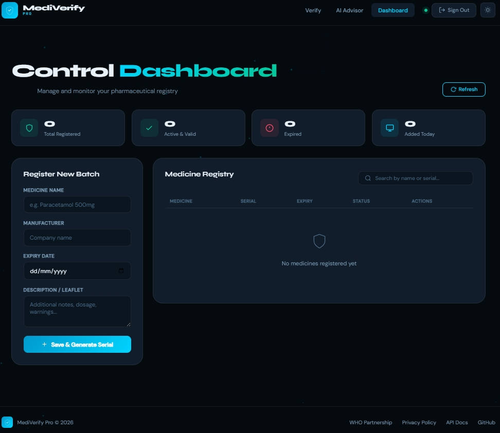
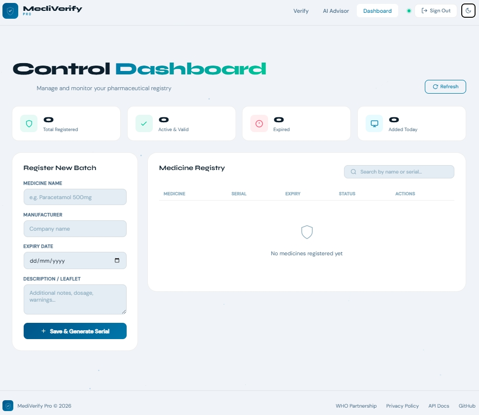

# 🛡️ MediVerify Pro
### **Advanced Medicine Authenticity & AI-Powered Pharmaceutical Management System**

**MediVerify Pro** is a professional Full-Stack solution (MERN Architecture) designed to combat counterfeit medicine. It empowers medical administrators to manage pharmaceutical inventory and generate unique, secure serial numbers, while providing a public portal for consumers to instantly verify product authenticity and safety status — backed by a real-time AI Health Advisor powered by Groq LLaMA.

---

## 📸 Project Showcases
 

---

| Dark Mode Interface | Light Mode Interface |
| :---: | :---: |
|  |  |
| *Premium Particle Canvas Design* | *Clean & Professional UI* |

| Dark Mode Interface | Light Mode Interface |
| :---: | :---: |
|  |  |

---

## ✨ Core Features

### 👤 Administrative Portal (Protected)
- **Secure Access:** Robust login/registration system using **JWT** (JSON Web Tokens) and **Bcryptjs** for password hashing.
- **Inventory Control (CRUD):** Full management of medicine records (Create, Read, Update, Delete).
- **Smart Serial Generation:** Utilizes **Crypto** to generate high-entropy, unique identifiers in the format `MV-XXXX-XXXX`.
- **Live Search:** Instant client-side filtering to navigate through large medicine databases efficiently.
- **Dashboard Stats:** Real-time counters for Total, Active, Expired, and Today's medicines.

### 🔍 Consumer Verification Engine
- **Instant Check:** Consumers can verify product serial numbers without an account.
- **Double-Safety Logic:** The system checks if the serial exists AND validates the **Expiry Date** to warn against outdated products.
- **Dynamic Results:** Inline result cards (Authentic ✅, Expired ⚠️, Counterfeit ❌) rendered directly on the page without popups.
- **QR Code Scanner:** Camera-based scanning using **jsQR** — consumers can scan packaging directly from their phone browser with no app required.

### 🤖 AI Health Advisor *(Upgraded)*
- **Symptom Analysis Chat:** A full conversational AI chat interface where users describe symptoms and receive structured pharmaceutical guidance.
- **Web Search Integration:** The AI uses **Brave Search API** + **Groq tool-calling** to fetch real-time, accurate medicine information before responding — not hallucinated data.
- **Strict Medical Rules:** The AI never diagnoses, never invents drug interactions, never guesses symptoms from a medicine name, and always recommends consulting a physician.
- **Structured Response Format:** Responses follow a fixed clinical format covering Active Ingredients, Dosage, Warnings, Drug Interactions, and When to Seek Medical Advice.
- **Conversation History:** Multi-turn chat with session memory (last 20 messages) for contextual follow-up questions.
- **Bulk Medicine Generator:** One-click generation of 10 verified medicines simultaneously with live progress bar and auto database entry.
- **Quick Symptom Chips:** Pre-built shortcut buttons for common conditions (Fever, Cold, Allergy, Pain Relief, etc.).
- **Secure Architecture:** Groq and Brave Search API keys are stored server-side in `.env` and never exposed to the frontend.

### 🎨 Visual Experience
- **Animated Particle Canvas:** Dynamic WebGL-style particle network rendered on an HTML5 canvas for a premium background effect.
- **Boot Loader:** Professional animated loader screen with triple-ring spinner on startup.
- **Theme Persistence:** Dark/Light mode toggle with smooth transitions, saved in `localStorage`.
- **Toast Notifications:** Lightweight, non-blocking toast system replacing popup alerts.
- **Fully Responsive:** Mobile-first layout that works on all screen sizes.

---

## 🛠️ Technical Stack

| Layer | Technologies Used |
| :--- | :--- |
| **Frontend** | HTML5, CSS3, JavaScript (ES6+), jsQR, Canvas API |
| **Backend** | Node.js, Express.js |
| **Database** | MongoDB (Mongoose ODM) |
| **Security** | JWT, Bcryptjs, CORS, express-rate-limit |
| **AI Integration** | Groq SDK (llama-3.3-70b-versatile) with Tool Calling |
| **Web Search** | Brave Search API (real-time medicine data) |
| **Utilities** | Crypto, Dotenv |

---

## 📁 Project Structure

```text
mediverify/
├── app.js                   # Server entry point, middleware, rate limiting
├── middleware/
│   └── auth.js              # JWT verification & route protection
├── models/
│   ├── Medicine.js          # Mongoose schema for medicine records
│   └── User.js              # Mongoose schema for admin users
├── public/
│   ├── index.html           # Main SPA entry point
│   ├── script.js            # Frontend logic, QR scanner, AI chat, canvas
│   └── style.css            # Custom CSS, dark/light theme, animations
├── routes/
│   ├── authRoutes.js        # Authentication API endpoints
│   ├── medicineRoutes.js    # Medicine CRUD & verification endpoints
│   └── aiRoutes.js          # AI chat (with web search) + bulk generate
├── .env.example             # Environment variable template
├── package.json             # Project dependencies & scripts
└── README.md                # Project documentation
```

---

## ⚙️ Installation & Deployment

### Clone the repository:
```bash
git clone https://github.com/MomenElsayedDev/MediVerify-Pro.git
cd MediVerify-Pro
```

### Install dependencies:
```bash
npm install
```

### Environment Setup:
Create a `.env` file in the root directory:
```dotenv
PORT=3000
MONGODB_URI=your_mongodb_connection_string
JWT_SECRET=your_super_secret_key_min_32_chars
GROQ_API_KEY=your_groq_api_key
BRAVE_SEARCH_API_KEY=your_brave_search_api_key
```

> **Getting API Keys:**
> - **Groq:** Free at [console.groq.com](https://console.groq.com)
> - **Brave Search:** Free tier (2,000 req/month) at [api.search.brave.com](https://api.search.brave.com)

### Launch the system:
```bash
# Development mode (with Nodemon)
npm run dev

# Production mode
npm start
```

---

## 🔌 API Endpoints

### Auth Routes — `/api/auth`

| Method | Endpoint | Description | Auth |
|--------|----------|-------------|------|
| POST | `/register` | Create admin account | ❌ |
| POST | `/login` | Login and get token | ❌ |

### Medicine Routes — `/api/medicines`

| Method | Endpoint | Description | Auth |
|--------|----------|-------------|------|
| GET | `/all` | Get all medicines | ❌ |
| GET | `/verify/:serial` | Verify by serial number | ❌ |
| GET | `/:id` | Get medicine by ID | ❌ |
| POST | `/add` | Add new medicine | ✅ |
| PUT | `/update/:id` | Update medicine details | ✅ |
| DELETE | `/delete/:id` | Delete a medicine | ✅ |

### AI Routes — `/api/ai`

| Method | Endpoint | Description | Auth |
|--------|----------|-------------|------|
| POST | `/chat` | AI symptom analysis with web search | ❌ |
| POST | `/suggest` | Generate & save one medicine entry | ❌ |

---

## 🔒 Reliability & Performance

🟢 **Rate Limiting:** Global 200 req/15min + AI-specific 20 req/min to prevent abuse and protect API quotas.

🟢 **JWT Route Protection:** All write operations (add, update, delete) require a valid admin token.

🟠 **CORS Enabled:** Cross-Origin Resource Sharing configured for secure frontend-backend communication.

🟢 **Real-Time AI Data:** Web search tool-calling ensures medicine information is fetched from live sources, not AI memory.

🟠 **Graceful Fallback:** If Brave Search is unavailable, the AI falls back to its internal knowledge without crashing.

🟢 **Collision-Resistant Serials:** Crypto-based serial generation with uniqueness retry loop — format `MV-XXXX-XXXX`.

🟢 **Secure API Keys:** All API keys stored server-side in `.env` and never exposed to the frontend.

---

## 🏆 Hackathon Highlights

| Real-World Problem | MediVerify Solution |
|---|---|
| 1M+ deaths annually from fake medicine (WHO) | Real-time serial authentication in 3 seconds |
| No fast consumer verification tool | QR camera scan — no app required |
| AI advisors hallucinate medicine data | Web search tool-calling for verified info |
| Manual, slow medicine registry | Bulk generate 10 medicines in one click |
| AI chat with no context | Multi-turn conversation with session history |

---

## Developed By Moamen Abouhaty